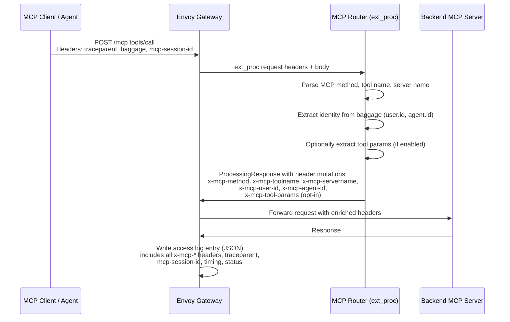

# MCP Audit Trail

## Problem

Operators running MCP Gateway have no persistent, queryable record of MCP interactions. The router emits OTel spans and sets request headers with MCP context (`x-mcp-method`, `x-mcp-toolname`, `x-mcp-servername`), but these signals are not surfaced in Envoy access logs. Access logs are the natural audit surface for platform engineers: persistent, shippable to SIEMs, and lower overhead than full distributed tracing.

MCP tool calls don't happen in isolation. They occur within broader agent workflows where a user asks an agent to accomplish a task, the agent reasons with an LLM, and the LLM decides to invoke one or more tools. A useful audit trail must provide enough correlation identifiers to join the gateway's slice of the story with upstream agent framework logs and downstream backend server logs.

## Summary

Enrich the MCP Router's request headers with audit-relevant fields (caller identity, optional tool call parameters) and configure Envoy access logging via the operator to produce a structured JSON audit trail covering all MCP methods supported by the gateway. Use existing `x-mcp-*` headers as the primary mechanism, with W3C Trace Context and Baggage headers for cross-system correlation. The operator manages a default access log format; users can override it.

## Goals

- Persistent audit trail of all MCP methods supported by the gateway (e.g. `tools/list`, `tools/call`, `prompts/list`) via Envoy access logs
- Correlation across three levels: agent workflow (traceparent), MCP session (mcp-session-id), individual request (x-request-id)
- Caller identity from W3C Baggage (`user.id`, `agent.id`) with fallback to auth-layer headers
- Opt-in tool call parameter logging with sensitivity controls
- Operator-managed access log configuration with user override capability
- Alignment with [kube-agentic-networking observability proposal](https://github.com/kubernetes-sigs/kube-agentic-networking/blob/main/docs/proposals/0033-Observability.md)

## Non-Goals

- Owning the full agent-to-tool audit chain (agent frameworks own their slice)
- Cryptographic attribution (e.g., signed receipts per tool call)
- Field-level parameter redaction (deferred to log aggregation pipelines)
- Recording whether a tool call was permitted by policy (policy-level audit is an application concern, not a gateway access log concern)
- Per-server audit configuration (deferred to AccessPolicy CRD / extensions SDK work)

## Job Stories

### When I need to know who called what

When a platform engineer investigates a compliance question or incident, they want to filter audit logs by caller identity (`user.id`, `agent.id`) and see which tools were invoked, when, and against which backend servers, so that they can attribute actions to specific users or agents.

### When agents don't send correlation headers

When an MCP client or agent doesn't propagate W3C Trace Context or Baggage headers, the platform engineer still wants tool calls logged with session ID, tool name, server name, and timing, so that the audit trail remains useful without requiring client cooperation.

### When I need to see what arguments were passed to a tool

When a compliance officer needs to verify what data was sent to a specific tool during an incident and parameter logging is already enabled, they want to review the tool call arguments in the audit log, so that they can assess data exposure without accessing the backend server's own logs.

## Design

### Prerequisites

- MCPGatewayExtension deployed (operator manages access log configuration)
- Auth configured via AuthPolicy if caller identity is needed (optional)
- MCP clients propagating W3C Trace Context and Baggage headers for full correlation (optional, graceful degradation without)

### Correlation Model

```
Agent Session / Task (traceparent trace ID, baggage user.id / agent.id)
  └── MCP Session (mcp-session-id)
       ├── tools/call create_issue    (x-request-id: abc-111)
       ├── tools/call search_prs      (x-request-id: abc-222)
       └── tools/call add_link        (x-request-id: abc-333)
```

| Level | Scope | Identifier | Source |
|-------|-------|------------|--------|
| Agent workflow | The broader task the agent is executing | `traceparent` trace ID, `baggage` `user.id` / `agent.id` | Client-provided (W3C standards) |
| MCP session | A single MCP connection lifecycle | `mcp-session-id` | Gateway-managed |
| Individual request | One tool call or tools/list | `x-request-id` | Envoy-generated |

This aligns with the [kube-agentic-networking observability proposal](https://github.com/kubernetes-sigs/kube-agentic-networking/blob/main/docs/proposals/0033-Observability.md) on W3C Trace Context and Baggage. Where we extend upstream: Envoy access logs as a lower-overhead audit surface complementary to OTel spans, concrete three-level correlation with joinable identifiers, and opt-in parameter logging with truncation as a middle ground between "log nothing" and "log everything."

### Flow



### Component Responsibilities

| Component | Responsibility |
|-----------|---------------|
| **MCP Router** | Parse baggage header, extract `user.id` / `agent.id`, set `x-mcp-user-id` / `x-mcp-agent-id` headers. Optionally extract and set `x-mcp-tool-params`. Existing `x-mcp-method`, `x-mcp-toolname`, `x-mcp-servername` headers unchanged. |
| **Operator** | Add access log `ConfigPatch` to the EnvoyFilter alongside the existing ext_proc patch. Default JSON format references `x-mcp-*` headers via `%REQ(...)%`. |
| **Envoy** | Write structured JSON access log entries to stdout. Include all `x-mcp-*` headers, `traceparent`, `mcp-session-id`, timing, status, upstream host. |

### API Changes

Audit configuration is exposed via an optional `audit` field on the MCPGatewayExtension CRD. When present, the operator adds the access log ConfigPatch to the EnvoyFilter and injects audit env vars into the router deployment. When absent, no access log is added (existing behavior preserved).

```go
// ParameterLoggingPolicy controls whether tool call parameters are included in the audit trail.
// +kubebuilder:validation:Enum=Enabled;Disabled
type ParameterLoggingPolicy string

const (
    ParameterLoggingEnabled  ParameterLoggingPolicy = "Enabled"
    ParameterLoggingDisabled ParameterLoggingPolicy = "Disabled"
)

// AuditConfig configures the MCP audit trail via Envoy access logs.
type AuditConfig struct {
    // parameterLogging controls whether tool call parameters are included in the audit trail.
    // Enabled: params.arguments from tools/call requests are logged (truncated to 1KB).
    // Disabled (default): parameters are not logged.
    // +optional
    // +default="Disabled"
    ParameterLogging ParameterLoggingPolicy `json:"parameterLogging,omitempty"`

    // identityHeaders specifies header names to check (in order) for caller
    // identity when baggage user.id is absent.
    // +optional
    // +default={"x-forwarded-email","x-auth-user"}
    IdentityHeaders []string `json:"identityHeaders,omitempty"`
}
```

Minimal example (defaults only, presence of `spec.audit` triggers the access log):

```yaml
apiVersion: mcp.kuadrant.io/v1alpha1
kind: MCPGatewayExtension
metadata:
  name: my-gateway
  namespace: mcp-gateway
spec:
  targetRef:
    name: my-gateway
    sectionName: mcp
  audit: {}
```

With parameter logging enabled and custom identity headers:

```yaml
apiVersion: mcp.kuadrant.io/v1alpha1
kind: MCPGatewayExtension
metadata:
  name: my-gateway
  namespace: mcp-gateway
spec:
  targetRef:
    name: my-gateway
    sectionName: mcp
  audit:
    parameterLogging: Enabled
    identityHeaders:
      - x-forwarded-email
      - x-auth-user
```

The operator translates these fields into env vars on the router deployment (`MCP_AUDIT_LOG_PARAMS`, `MCP_AUDIT_IDENTITY_HEADERS`). The router reads env vars — it has no direct CRD dependency.

### Data Storage

None. Audit data is written to Envoy access logs on stdout — storage and retention are handled by the platform's log collection pipeline.

### Router Changes

**New headers set on requests:**

| Header | Source | Description |
|--------|--------|-------------|
| `x-mcp-user-id` | `baggage` header, key `user.id` | Authenticated user identity. Falls back to auth-layer headers (configurable via `spec.audit.identityHeaders`). `-` if unavailable. |
| `x-mcp-agent-id` | `baggage` header, key `agent.id` | Agent identity. `-` if unavailable. |
| `x-mcp-tool-params` | Request body `params.arguments` | Tool call arguments as JSON. Only set when `spec.audit.parameterLogging` is `Enabled`. Truncated to 1KB. |

**Existing headers (unchanged):**

| Header | Description |
|--------|-------------|
| `x-mcp-method` | MCP method (`tools/call`, `tools/list`, etc.) |
| `x-mcp-toolname` | Tool name (after prefix stripping) |
| `x-mcp-servername` | Backend MCP server name |
| `mcp-session-id` | MCP session identifier |

**Baggage parsing:** Extract key-value pairs from the `baggage` header per [W3C Baggage specification](https://www.w3.org/TR/baggage/). Look up `user.id` and `agent.id` keys. URL-decode values. After decoding, strip any control characters (CR, LF, null bytes) to prevent header injection — the baggage header is client-controlled and could contain encoded newlines.

**Identity fallback:** When `user.id` is absent from baggage, check headers listed in `spec.audit.identityHeaders` (checked in order). Defaults to `x-forwarded-email,x-auth-user`. First non-empty value is used for `x-mcp-user-id`.

**Parameter logging:** Gated by `spec.audit.parameterLogging` (default: `Disabled`). When `Enabled`, extract `params.arguments` from the parsed MCP request body, serialize as JSON, truncate to 1KB, and set as `x-mcp-tool-params`. Sensitive field redaction is deferred to log aggregation pipelines. Note: enabling parameter logging means any secrets passed as tool arguments (API keys, tokens, credentials) will appear in access logs. The auditing guide should warn operators of this and recommend restricting access log storage accordingly.

### Operator Changes

When `spec.audit` is set, the operator adds a second `ConfigPatch` to the EnvoyFilter it builds in `buildEnvoyFilter()`. This patch uses `ApplyTo: NETWORK_FILTER` to merge an `access_log` configuration into the `envoy.filters.network.http_connection_manager` on the same listener (matching the same `listenerConfig.Port`) as the ext_proc filter. The operator also injects `MCP_AUDIT_LOG_PARAMS` and `MCP_AUDIT_IDENTITY_HEADERS` env vars into the router deployment based on the CRD fields.

The patch operation is `MERGE` — this differs from the ext_proc patch which uses `INSERT_FIRST`. The ext_proc patch inserts a new HTTP filter into the filter chain, so it needs `INSERT_FIRST` to position it before the router filter. The access log patch modifies an existing network filter (HCM) to add an `access_log` field, so `MERGE` is correct — it applies proto merge semantics to combine the access log config into the existing HCM configuration. See [Istio EnvoyFilter patch operations](https://istio.io/latest/docs/reference/config/networking/envoy-filter/) for details on `MERGE` vs `INSERT_FIRST`.

**Default JSON access log format:**

```json
{
  "timestamp": "%START_TIME%",
  "method": "%REQ(:METHOD)%",
  "path": "%REQ(:PATH)%",
  "response_code": "%RESPONSE_CODE%",
  "request_id": "%REQ(X-REQUEST-ID)%",
  "traceparent": "%REQ(TRACEPARENT)%",
  "mcp_method": "%REQ(X-MCP-METHOD)%",
  "mcp_tool_name": "%REQ(X-MCP-TOOLNAME)%",
  "mcp_server_name": "%REQ(X-MCP-SERVERNAME)%",
  "mcp_session_id": "%REQ(MCP-SESSION-ID)%",
  "mcp_user_id": "%REQ(X-MCP-USER-ID)%",
  "mcp_agent_id": "%REQ(X-MCP-AGENT-ID)%",
  "mcp_tool_params": "%REQ(X-MCP-TOOL-PARAMS)%",
  "duration_ms": "%DURATION%",
  "upstream_host": "%UPSTREAM_HOST%",
  "bytes_sent": "%BYTES_SENT%",
  "bytes_received": "%BYTES_RECEIVED%"
}
```

- Logged to stdout on the gateway pod (standard for Kubernetes log collection)
- Access log only added when `spec.audit` is set on the MCPGatewayExtension
- Users can override by applying their own EnvoyFilter with `MERGE` or `REPLACE` targeting the access log

### Example User Flow

**Scenario:** A platform engineer at Acme Corp audits which agents are calling which tools. They have a coding agent using GitHub and Jira MCP servers behind the gateway.

```
Developer asks coding agent: "Create a Jira ticket for the login bug and link the GitHub PR"

Agent workflow:
  1. tools/call jira_create_issue  → Jira MCP server
  2. tools/call github_search_prs  → GitHub MCP server
  3. tools/call jira_add_link      → Jira MCP server

Each call flows: Agent → Envoy → Router (ext_proc) → Backend MCP Server
```

**Access log output (3 entries, same trace ID and session):**

```json
{"timestamp":"2026-05-08T14:23:01.123Z","method":"POST","path":"/mcp","response_code":200,"request_id":"abc-111","traceparent":"00-4bf92f3577b34da6a3ce929d0e0e4736-00f067aa0ba902b7-01","mcp_method":"tools/call","mcp_tool_name":"create_issue","mcp_server_name":"jira","mcp_session_id":"sess-7a3b","mcp_user_id":"dev-jane","mcp_agent_id":"coding-agent-v2","mcp_tool_params":"-","duration_ms":342,"upstream_host":"10.0.1.5:8080","bytes_sent":1024,"bytes_received":512}

{"timestamp":"2026-05-08T14:23:02.456Z","method":"POST","path":"/mcp","response_code":200,"request_id":"abc-222","traceparent":"00-4bf92f3577b34da6a3ce929d0e0e4736-0e8b2a1c4d5f6789-01","mcp_method":"tools/call","mcp_tool_name":"search_prs","mcp_server_name":"github","mcp_session_id":"sess-7a3b","mcp_user_id":"dev-jane","mcp_agent_id":"coding-agent-v2","mcp_tool_params":"-","duration_ms":218,"upstream_host":"10.0.2.3:8080","bytes_sent":890,"bytes_received":2048}

{"timestamp":"2026-05-08T14:23:03.789Z","method":"POST","path":"/mcp","response_code":200,"request_id":"abc-333","traceparent":"00-4bf92f3577b34da6a3ce929d0e0e4736-1a2b3c4d5e6f7890-01","mcp_method":"tools/call","mcp_tool_name":"add_link","mcp_server_name":"jira","mcp_session_id":"sess-7a3b","mcp_user_id":"dev-jane","mcp_agent_id":"coding-agent-v2","mcp_tool_params":"-","duration_ms":156,"upstream_host":"10.0.1.5:8080","bytes_sent":768,"bytes_received":256}
```

**What a platform engineer can answer:**

| Question | How |
|----------|-----|
| Which tools did `dev-jane` use today? | Filter by `mcp_user_id` |
| How many tool calls did `coding-agent-v2` make this week? | Filter by `mcp_agent_id` |
| What was the full sequence of calls for this task? | Filter by `traceparent` trace ID (`4bf92f...`) |
| Which calls belong to the same MCP session? | Filter by `mcp_session_id` |
| Which backend servers are getting the most traffic? | Aggregate by `mcp_server_name` |
| Are there slow tool calls? | Sort by `duration_ms` |
| Did any calls fail? | Filter by `response_code != 200` |

**Without client cooperation (no baggage, no traceparent):**

```json
{"timestamp":"2026-05-08T14:25:01.123Z","method":"POST","path":"/mcp","response_code":200,"request_id":"def-444","traceparent":"-","mcp_method":"tools/call","mcp_tool_name":"create_issue","mcp_server_name":"jira","mcp_session_id":"sess-9x2f","mcp_user_id":"-","mcp_agent_id":"-","mcp_tool_params":"-","duration_ms":305,"upstream_host":"10.0.1.5:8080","bytes_sent":1024,"bytes_received":512}
```

Still useful: tool name, server, session, timing, and response code are all present. Cross-system correlation and identity attribution require client cooperation.

### Configuration

Audit is configured via the `spec.audit` field on the MCPGatewayExtension CRD:

| CRD Field | Default | Description |
|-----------|---------|-------------|
| `spec.audit.parameterLogging` | `Disabled` | Enable tool call parameter logging (`Enabled` / `Disabled`) |
| `spec.audit.identityHeaders` | `["x-forwarded-email", "x-auth-user"]` | Header names to check (in order) for caller identity when baggage `user.id` is absent |

The operator translates these into env vars on the router deployment:

| Env Var | Source | Translation |
|---------|--------|-------------|
| `MCP_AUDIT_LOG_PARAMS` | `spec.audit.parameterLogging` | `Enabled` -> `"true"`, `Disabled`/empty -> `"false"` |
| `MCP_AUDIT_IDENTITY_HEADERS` | `spec.audit.identityHeaders` | Comma-joined |

These env vars are operator-managed. The router reads them at startup — it has no direct CRD dependency.

### AuthPolicy Integration

Authorino (which backs Kuadrant's AuthPolicy) already logs its own authorization decisions with structured logging and per-evaluator metrics. Rather than intercepting or duplicating those decisions in the MCP Gateway, we rely on two existing mechanisms:

1. **Correlation via `x-request-id`**: Authorino's decision logs and the MCP Gateway access logs both include `x-request-id`, so platform engineers can join them in their log aggregation system.
2. **AuthPolicy response headers**: Authorino can be configured to inject auth pipeline data back into the request as HTTP headers via [AuthConfig response definitions](https://github.com/Kuadrant/authorino/blob/main/docs/features.md). For example, an AuthPolicy can set `x-auth-decision`, `x-auth-user-id`, or other headers that then appear in the MCP Gateway access log via `%REQ(...)%` — no MCP Gateway code changes needed.

The auditing guide should document this pattern with examples of AuthPolicy configuration that surfaces auth decisions in the audit log.

> **Note:** MCP Gateway and Authorino are both Kuadrant projects. A unified audit configuration surface — where a single CRD configures both tool call auditing and auth decision logging — is a natural evolution. This is deferred until the base audit trail is validated, but should be pursued to avoid forcing platform engineers to configure audit logging in two places. See Future Considerations. Implementing the agentic-networking [AccessPolicy CRD (#804)](https://github.com/Kuadrant/mcp-gateway/issues/804) may be a good time to consider this.

### Backwards Compatibility

No breaking changes. The new `x-mcp-user-id`, `x-mcp-agent-id`, and `x-mcp-tool-params` headers are additive. Existing `x-mcp-*` headers are unchanged. The access log is a new output that doesn't affect request processing.

## Security Considerations

- **Parameter sensitivity**: Parameter logging is opt-in (default off) and truncated to 1KB; field-level redaction is deferred to log aggregation pipelines.
- **Identity source**: `x-mcp-user-id` should come from validated auth context (auth-layer headers set after JWT validation), not raw client-provided headers.
- **Baggage injection**: `user.id` and `agent.id` from the `baggage` header are informational, not authoritative — authoritative identity comes from the auth layer.
- **Audit log sensitivity**: Access logs containing identity and tool usage data should be shipped securely and access-restricted.

## Relationship to Existing Observability

This builds on the [observability design](../observability.md):

| Concern | Surface | Purpose |
|---------|---------|---------|
| Debugging | OTel traces + structured logs | "What went wrong with this request?" |
| Analytics | OTel metrics | "How many tool calls per server per hour?" |
| **Auditing** | **Envoy access logs** | **"Who called what, when, and with what arguments?"** |

Traces are for debugging, metrics are for patterns, access logs are for accountability. They complement each other. The same `traceparent` and `mcp-session-id` identifiers appear in all three, enabling cross-reference.

## Future Considerations

- **Dynamic metadata**: If header-based access logging hits limitations (e.g., headers not available in certain Envoy access log contexts), fall back to ext_proc dynamic metadata with `%DYNAMIC_METADATA(mcp-audit:...)%` format strings.
- **Custom access log format**: Expose the JSON log format as a CRD field so operators can customize without writing EnvoyFilters.
- **Field-level parameter redaction**: Allow operators to specify fields to redact from tool call parameters before logging.
- **Per-server audit configuration**: Configure parameter logging per MCPServerRegistration (some servers may have sensitive params, others not).
- **Unified Kuadrant audit surface**: MCP Gateway and Authorino are both Kuadrant projects. A single CRD or configuration point that combines tool call auditing with auth decision logging would give platform engineers one place to configure "MCP audit logging" rather than two. This could surface Authorino's allow/deny decisions, identity resolution, and policy evaluations alongside tool call metadata in a unified audit log. The [AccessPolicy CRD (#804)](https://github.com/Kuadrant/mcp-gateway/issues/804) work is a natural point to design this unified surface.
- **Signed audit records**: Cryptographic attribution per tool call for high-compliance environments.

## Execution

- [Implementation plan](tasks/tasks.md)
- [E2E test cases](tasks/e2e_test_cases.md)
- [Documentation plan](tasks/documentation.md)

## Change Log

### 2026-05-13 — Add CRD API for audit configuration

- Added `spec.audit` field to MCPGatewayExtension CRD (gateway-level configuration)
- `spec.audit` presence triggers access log ConfigPatch and env var injection
- Operator translates CRD fields to env vars on the router deployment
- `parameterLogging` uses `Enabled`/`Disabled` enum (not boolean), matching existing CRD patterns
- Per-server configuration deferred to AccessPolicy CRD / extensions SDK

### 2026-05-08 — Initial design

- Header-first approach using existing `x-mcp-*` pattern (dynamic metadata deferred unless limitations found)
- W3C Baggage for caller identity aligned with kube-agentic-networking proposal
- Three-level correlation model: agent workflow, MCP session, individual request
- Opt-in parameter logging
- Operator-managed access log with user override capability

## References

- [kube-agentic-networking observability proposal](https://github.com/kubernetes-sigs/kube-agentic-networking/blob/main/docs/proposals/0033-Observability.md)
- [W3C Baggage specification](https://www.w3.org/TR/baggage/)
- [W3C Trace Context specification](https://www.w3.org/TR/trace-context/)
- [Envoy access log format](https://www.envoyproxy.io/docs/envoy/latest/configuration/observability/access_log/usage)
- [Envoy dynamic metadata](https://www.envoyproxy.io/docs/envoy/latest/configuration/advanced/well_known_dynamic_metadata)
- [OpenTelemetry GenAI semantic conventions](https://opentelemetry.io/docs/specs/semconv/gen-ai/)
- [Authorino observability](https://docs.kuadrant.io/1.3.x/authorino/docs/user-guides/observability/)
- [Authorino dynamic response features](https://github.com/Kuadrant/authorino/blob/main/docs/features.md)
